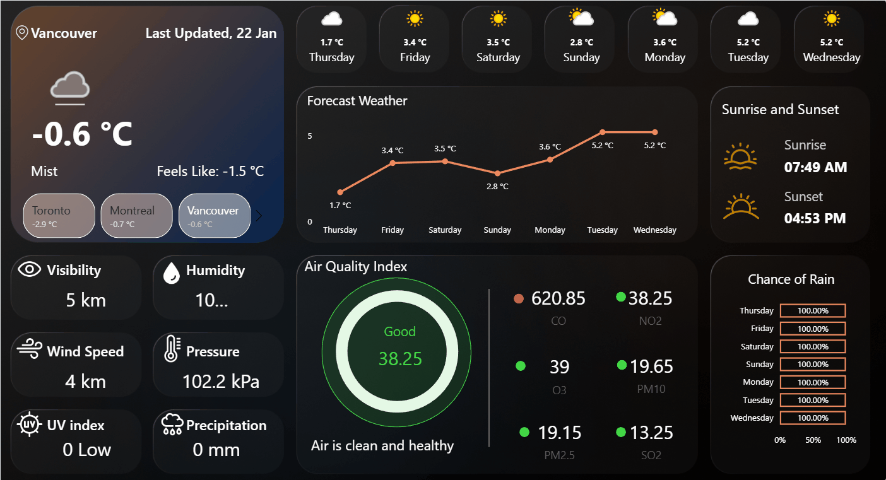

# 🇨🇦 Canada Weather Analytics – Power BI

## 📌 Project Overview

This Power BI project provides an **interactive, real-time weather analysis dashboard** for major cities across Canada. The report is designed to deliver **live weather conditions, 7-day forecasts, air quality insights, and environmental metrics** through a modern, visually rich interface.

The dashboard leverages **dynamic measures, conditional formatting, and image-based visuals** to create an engaging and user-friendly analytics experience.

---

## 🌐 Data Source

* **Weather API**: [https://www.weatherapi.com/](https://www.weatherapi.com/)
* **Data Type**: Live & forecast weather data
* **Refresh Type**: API-based (real-time / near real-time)

The WeatherAPI is used to retrieve:

* Current weather conditions
* 7-day weather forecast
* Air Quality Index (AQI)
* Sunrise & sunset times
* Atmospheric and environmental metrics

---

## 🏙️ Cities Covered

The report currently analyzes weather data for the following **7 Canadian cities**:

* Toronto
* Vancouver
* Montreal
* Ottawa
* Calgary
* Halifax
* Winnipeg

Users can seamlessly switch between cities using **dynamic city selectors**, which automatically update all visuals and KPIs.

---

## 📊 Key Features & KPIs

### 🌡️ Weather Metrics

* Current temperature
* Feels-like temperature
* Weather condition (Sunny, Cloudy, Snow, Rain, etc.)
* Visibility (km)
* Humidity (%)
* Wind speed (km/h)
* Atmospheric pressure (kPa)
* UV Index
* Precipitation (mm)

### 📈 Forecast Analysis

* 7-day temperature trend line
* Daily condition icons (sun, snow, rain, clouds)
* Daily chance of rain (%)

### 🌅 Astronomical Data

* Sunrise time
* Sunset time

### 🌍 Air Quality Index (AQI)

* AQI score with qualitative classification (Good, Moderate, etc.)
* Pollutant-level breakdown:

  * CO
  * NO₂
  * O₃
  * PM10
  * PM2.5
  * SO₂

---

## 🎨 Design & Visualization Highlights

* **Dynamic cards** driven by DAX measures
* **Conditional formatting** for colors based on temperature, AQI, and weather conditions
* **Dynamic text and icons** that change based on selected city and weather status
* **Dynamic Tooltips** Custom tooltip pages are created with advanced layout and styling, showing dynamic text and weather icons
* **Custom images and weather icons** for enhanced user experience
* **Dark-themed, modern UI layout** optimized for dashboards

All visuals respond dynamically to city selection, ensuring a consistent and interactive experience.

---

## 🧠 Technical Implementation

* **Tool**: Microsoft Power BI
* **Modeling**: Star-schema-inspired structure for performance
* **DAX**:

  * Dynamic measures for KPIs
  * Conditional logic for text, images, and color themes
  * Time-based calculations for forecast analysis
* **API Integration**:

  * JSON data ingestion
  * Transformation using Power Query (M)
  * Data shaping, normalization, and type handling

---

## 📂 Repository Structure

```
├── powerbi/
│   └── Toronto_Weather_Report.pbix
├── data/images                
├── screenshots/   
├── README.md
└── .gitignore
```

---

## 📸 Dashboard Preview


Here’s a live preview:



> Refer to the screenshots folder for dashboard visuals showcasing:

---

## 🧑‍💻 Author

**Vivek Reddy**
Data Engineer | Power BI Developer

---

## 📄 License

This project is for **learning, portfolio, and demonstration purposes**. Weather data is provided by WeatherAPI and subject to their usage terms.

---

✨ *If you like this project, feel free to explore the repository or suggest improvements!*
